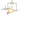

Schema
------

.. toctree::
   :hidden:
   :maxdepth: 2
   :caption: Contents:

   elements

The `elektron` module allows for drawing circuits. The drawing follows the basic structure containing pre-defined elements for use in a drawing. A common import structure is:

.. code-block:: python
   :linenos:

   from elektron import Draw, Element, Label, Line, Nc, Dot

.. autoclass:: recad::Schema

To create a circuit diagram, use a context manager (with statement) on a `schemdraw.Drawing`. Any elements created within the with block will be added to the drawing:

.. exec_code::
   :linenos:

   from recad import *

   schema = Schema("test-project")
   schema.move_to((50.8, 50.8))
   schema = (schema
       + LocalLabel("Vin").rotate(180) 
       + Wire().right()
       + Symbol("R1", "100k", "Device:R").rotate(90)
       + Junction()
       + Symbol("U1", "TL072", "Amplifier_Operational:LM2904").anchor("2").mirror("x")
       + Junction()
       + Wire().up().length(4)
       + Symbol("R2", "100k", "Device:R").rotate(270).tox("U1", "2")
       + Wire().toy("U1", "2")
       + Symbol("GND", "GND", "power:GND").at("U1", "3")
       + LocalLabel("Vout").at("U1", "1")
   )
   
   schema.plot(path = 'docs/_static/schema_opamp.svg')

